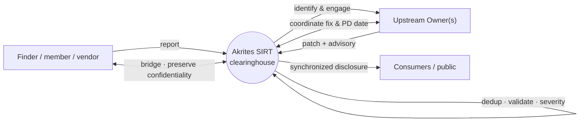

# Akrites SIRT Coordinated Vulnerability Disclosure (CVD) Policy - DRAFT v0.4

**Status:** Draft v0.4
**Owner:** Akrites SIRT (Security Incident Response Team)
**Primary contact:** SIRT@Akrites.dev
**Canonical URL:** https://sirt.akrites.dev/security/policy
**Last updated:** 2026-08-24

> **Naming:** **Akrites SIRT** — the Security Incident Response Team hosted by the
> Akrites Foundation — is the standard name used throughout this document.
> "OSS-SIRT" appears in some earlier materials as a synonym for the same body.

---

## 1. Purpose

This policy describes how the Akrites SIRT receives, validates, coordinates, and
discloses security vulnerabilities. It exists so that **Finders**, **Owners**,
**Collaborators**, and **Consumers** all share one clear, predictable
understanding of how a report moves from first contact to public disclosure.

The Akrites SIRT operates on two commitments that must be held in balance:

- **Openness by default.** The process itself — this policy, our lifecycle,
  our role definitions, our templates, and (after disclosure) our advisories —
  is public and reviewable by anyone.
- **Confidentiality where it matters.** The specific, case-level details of an
  unpatched vulnerability are kept private among a strict need-to-know group
  until the agreed public disclosure date, so that users are not exposed to
  attack before a fix is available.

This work is informed by and based upon the FIRST [*Guidelines and Practices for
Multi-Party Vulnerability Coordination and Disclosure*](https://www.first.org/global/sigs/vulnerability-coordination/multiparty/guidelines-v1.1) and the FIRST [*PSIRT
Services Framework*](https://www.first.org/standards/frameworks/psirts/psirt_services_framework_v1.1).

## 2. Scope

This policy applies to the projects and components for which the Akrites SIRT acts
as coordinator or owner, and to all reports the SIRT receives through the channels
in Section 4. In most cases the SIRT is **not** the Owner; it acts as a neutral
clearinghouse and coordinator (see Section 6). Where a vulnerability affects
upstream or downstream open source projects, the SIRT coordinates disclosure with
those communities as described in this policy.

## 3. Definitions

### Roles & access

- **Finder** — The individual or organization that discovers a potential
  security flaw and reports it.
- **Owner** — The maintainer, security team, or organization responsible for a
  project's code and its ongoing security posture. For coordinated cases,
  the Akrites SIRT may act as Owner or, more commonly, as a neutral coordinator
  between Owners.
- **Collaborator** — A trusted third party (for example a downstream developer
  or a security expert) brought in to help validate or fix a vulnerability.
- **Consumers** — The end users, organizations, and downstream developers who
  use the software and must eventually apply fixes to stay secure.
- **Need-to-Know** — The principle that access to sensitive information about a
  vulnerability is restricted to only those individuals necessary for its
  resolution.
- **Read-In** — The formal process of briefing a Collaborator on the details of
  a non-public vulnerability, normally accompanied by an agreement to maintain
  confidentiality.

### Technical terms

- **Potential Vulnerability** — A bug or behavior that appears to be a security
  risk but has not yet been confirmed or triaged.
- **Vulnerability** — A validated weakness that can be exploited to compromise
  confidentiality, integrity, or availability.
- **Root Cause** — The underlying technical error or design flaw (often
  categorized as a CWE) that allows the vulnerability to exist.
- **Severity** — A measurement (typically CVSS) of impact and exploitability,
  ranked Low to Critical.
- **Vulnerability Identifier** — A unique label (such as a CVE ID) used to track
  a flaw across the industry.

### Resolution & communication

- **Patch** — A code-level fix that eliminates the root cause.
- **Work-around** — A temporary mitigation (such as a configuration change) that
  reduces risk without modifying source code.
- **Embargo** — A period during which vulnerability details are kept
  confidential among a small group of stakeholders to allow a fix to be
  developed and staged.
- **Public Disclosure (PD)** — The specific date and time when information about
  a vulnerability is made available to the general public.
- **Documentation** — The advisories, release notes, and mitigation
  instructions that explain the vulnerability and how to fix it.

### AI tooling

- **AI / LLM tooling** — Artificial-intelligence tools, most notably large
  language models (LLMs), used to help discover, reproduce, analyze, triage,
  patch, test, score, translate, or document a vulnerability.
- **AI-use disclosure** — A capability-level statement, published for both the
  Finder and the Akrites SIRT, of whether and how AI tooling was used in a case.
  See Section 13 and the [AI and LLM Use Disclosure Policy](docs/ai-use-disclosure.md).

## 4. How to report a vulnerability

We want reporting to be low-friction. Use whichever of the following is easiest
for you.

### 4.1 Preferred: GitHub private vulnerability reporting

Whenever the affected project is on GitHub, **please use GitHub's private
vulnerability reporting** ("Report a vulnerability" on the repository's
**Security** tab). This keeps the report, the discussion, and any temporary
private fork in one place, and lets us add you as a collaborator on the draft
advisory so you can stay involved through remediation.

### 4.2 Alternative: encrypted email

If GitHub reporting is unavailable or unsuitable, email **SIRT@Akrites.dev**.

- The intake address supports hop-to-hop transport encryption (MTA-STS /
  STARTTLS). For end-to-end protection of especially sensitive details, you may
  encrypt to our OpenPGP key published at the Canonical URL above.
- We would rather receive the report than have you struggle with encryption —
  if in doubt, send it.

### 4.3 What to include

To help us triage and reproduce quickly, please include where known:

- The affected project, component, and version(s).
- The environment where the issue was observed (OS, architecture, platform,
  configuration).
- Step-by-step reproduction details; proof-of-concept code or screenshots are
  very helpful.
- The potential impact and how an attacker might exploit the issue.
- Any embargo or disclosure timing you would like us to honor.
- Whether and how you wish to be credited.
- **Whether and how you used AI or LLM tooling** in finding, analyzing, or
  writing up the issue, and whether that tooling was a public service or a
  private/confidential one. This helps us credit the work accurately and, per
  Section 8 and Section 13, classify the report's embargo eligibility. It does
  not affect whether we accept your report.

Reports may be submitted in English. You may report anonymously; if you do, we
cannot send you status updates (anonymous public reporting opens in the final
rollout phase — see Section 12).

## 5. Our commitments to you

- **Acknowledge** receipt within **2 business days**.
- **Triage and validate**, providing an initial assessment within
  **10 business days**, and confirm whether we consider the report a
  vulnerability, a non-security bug, or expected behavior.
- **Communicate continuously** — we maintain an open dialogue, give status
  updates, and are transparent about anything that may delay resolution.
- **Respect confidentiality** — we handle case material under TLP 2.0, starting
  at **TLP:RED** at intake and tightening to need-to-know **TLP:AMBER+STRICT**
  during remediation, reclassified to **TLP:CLEAR** at the agreed public date.
  We share only with those who need to know.
- **Credit you** — by default we attribute findings to the Finder; we will
  honor requests for anonymity. We do not require nor can we provide an NDA.
- **Be transparent about AI use** — every advisory states, for both you and the
  Akrites SIRT, whether and how AI/LLM tooling was used, at a capability level.
  See Section 13.

These timelines are defaults; more or less time may be appropriate depending on
severity, active exploitation, or patch complexity. We treat declared
timeframes as the start of a negotiation, not a hard wall.

## 6. The Akrites SIRT's role as coordinator

In most cases the Akrites SIRT is **not** the Owner of the affected code. Its role
is that of a neutral **clearinghouse and coordinator** — the single front door
that bridges Finders, Owners, Akrites members, and the public. The nine-phase
lifecycle in Section 7 describes the *vulnerability's* journey from report to
disclosure; this section describes the *SIRT's* actions across that journey.
Where the SIRT is itself the Owner, it performs both roles at once.

The coordinator function centers on three activities that are distinct from an
Owner's own vulnerability handling:

1. **Intake and routing.** Receive a report when the SIRT is not the Owner;
   deduplicate it against work already in flight; validate the finding and its
   severity; and identify the right upstream project(s) and maintainer(s) to
   engage, confirming or assigning ownership.
2. **Bridging Finder and Owner.** Establish a trusted channel between parties who
   often have no pre-existing relationship, carrying information in both
   directions while preserving each side's confidentiality obligations — the
   Finder's anonymity and the Owner's embargo alike.
3. **Synchronizing multi-project disclosure.** When a vulnerability spans
   dependencies, align independent Owners — who may have different timelines,
   release cadences, and disclosure policies — onto a single coordinated Public
   Disclosure, using one CVE ID to describe the same flaw across vendors.

This coordinator workflow is the program's primary operating mode, not an
exception: no neutral, centralized entity otherwise exists to efficiently
validate, route, and synchronize complex multi-party reports to upstream
maintainers.



In practice this means:

- The SIRT can act as coordinator when a Finder cannot reach an upstream Owner,
  or when a vulnerability spans multiple projects.
- A single CVE ID is used to describe the same flaw in unmodified code across
  vendors, so Consumers can understand their exposure.
- Where agreed with the participants, the SIRT provides advance notice to
  downstream providers under embargo (typically 1–30 working days before PD,
  scaled to severity and patch complexity), including the CVE ID, description,
  affected versions, how the patch will be made available, and the PD date. The
  tiered pre-disclosure model is described in the
  [Read-in Tier Policy](docs/Read-in%20Tier%20Policy.md).

The operational detail for these activities during the Coordination phase —
determining the governing timeline, setting PD to the shortest applicable
window, setting Finder expectations at intake, and handling duplicates
transparently — is specified in the
[Embargo Handling Guidance](docs/Embargo%20Handling%20Guidance.md) (§6, Operating
rules for the SIRT), incorporated here by reference.

## 7. The vulnerability lifecycle

The lifecycle below traces the **vulnerability's** journey. In most cases the
Akrites SIRT acts as coordinator across these phases rather than as the Owner
(see Section 6).

```
Discover → Deduplicate & Triage → Validate → Coordination → Patch → Test → Document → Distribute → Disclose
```

1. **Discover** — A Finder identifies a potential vulnerability and reports it
   through the channels in Section 4.

2. **Deduplicate & Triage** — The report is first checked against work already in
   flight and merged if it duplicates a known case. Deduplication is the critical
   first step — a large share of reports arrive already known or in-flight. The
   Owner (or the SIRT, as coordinator) then reviews the report against prior risk
   assessments, threat models, and bug bars to decide whether it is a
   vulnerability, a bug, or intended behavior.

3. **Validate** — The finding is confirmed or refuted and reproduced, and its
   severity and root cause are enriched (CWE, CVSS, blast radius). Additional
   parties may be brought in to assist with review.

4. **Coordination** — Trusted Collaborators with a need-to-know are read in to
   assist with remediation, distribution, and disclosure. The team determines
   whether an **embargo** is required and sets the **Public Disclosure (PD)**
   date, and prepares for the contingency that the embargo breaks early —
   deciding what can be shared with Consumers to protect themselves if details
   leak before PD.

5. **Patch** — The Owner and read-in Collaborators determine the best fix and
   create a patch or work-around that eliminates the root cause.

6. **Test** — The patch is run through regression, smoke, and other testing to
   confirm the vulnerability is resolved and no new regressions are introduced.

7. **Document** — The vulnerability is documented for downstream consumption:
   a vulnerability identifier (CVE), the affected package/versions, the
   weakness/root cause (CWE), a severity estimate (CVSS v4.0, or CVSS v3.1 for
   legacy comparison), the actions Consumers should take, where to obtain the
   patch, the **AI-use disclosure** for the case (Section 13), and any other
   relevant information. Optional collateral such as blogs, FAQs, or Q&As may
   also be produced.

8. **Distribute** — The patch and related documentation are staged so that
   Consumers gain access to the upstream remediation at the same time (at PD)
   from a public repository (preferably the upstream project's delivery channel).
   Documentation is shared with read-in Collaborators so they can prepare
   consistent, tailored communications for their own implementations. This
   includes Security Advisory texts, patches, work-arounds and/or mitigations,
   or other collateral the Maintainer and Finder deem relevant.

9. **Disclose** — On the PD date, the vulnerability is publicly disclosed and the
   patch and all associated documentation are released.

### Lifecycle phases mapped to the operational pipeline

The nine lifecycle phases nest within the four operational stages of the SIRT's
processing pipeline:

| Operational stage | Lifecycle phase(s) |
| --- | --- |
| 1. Deduplication (intake) | 1 Discover · 2 Deduplicate & Triage |
| 2. Enrichment (CWE, CVSS, blast radius; validate & assign ownership) | 3 Validate |
| 3. Fix development | 4 Coordination · 5 Patch · 6 Test |
| 4. Disclosure management (AVID) | 7 Document · 8 Distribute · 9 Disclose |

## 8. Embargo and confidentiality handling

This is where the "open process, private data" balance is enforced.

- **Traffic Light Protocol (TLP 2.0).** Case material follows a phased TLP model
  rather than a single blanket label, so confidentiality scales appropriately as
  collaboration needs grow:
  - **TLP:RED at intake** — the initial report is held for named recipients only.
  - **TLP:AMBER+STRICT during patch development** — once a case is opened and
    read-in Collaborators are engaged, case and patch material is shareable on a
    need-to-know basis within participating organizations (excluding clients and
    third parties), enabling the collaboration a fix requires.
  - **TLP:CLEAR at Public Disclosure** — material is reclassified for open
    sharing at PD.
  Material is never redistributed beyond what its current TLP label permits
  without the Owner's explicit consent. This mirrors the enforcement model in the
  [Embargo Handling Guidance](docs/Embargo%20Handling%20Guidance.md) (§6).
- **Need-to-know and read-in.** Access to embargoed details is restricted to the
  individuals required to resolve the issue. Collaborators are formally read in
  and are expected to maintain confidentiality until PD.
- **Private development.** Patches are developed and tested privately (for
  GitHub projects, in a temporary private fork / draft Security Advisory) so an
  observant attacker cannot spot the fix before users can apply it.
- **AI tooling and confidentiality.** Public, hosted AI/LLM services are not
  confidential. A report developed with public LLM tooling is treated as having
  **no embargo available** and is handled on an accelerated / assume-exposed
  basis; parties who need to preserve the embargo option must use private,
  confidential tooling. This is why AI use is captured at intake (Section 4.3).
  See the [Embargo Handling Guidance](docs/Embargo%20Handling%20Guidance.md) §4.3.
- **Embargo duration.** The SIRT's default planning target is a PD within
  **30 days** of a validated report, **deferring to the upstream project's own
  disclosure policy** where one exists. The governing timeline is set by the
  precedence hierarchy in the
  [Embargo Handling Guidance](docs/Embargo%20Handling%20Guidance.md): a project's
  published policy or a coordinating list's cap takes precedence over the
  default, and where multiple parties are involved the tightest binding
  constraint governs the synchronized window. For reference, industry norms vary
  widely — the distros list prefers under 7 days (14-day maximum), CERT/CC
  commonly uses 45 days, and 90 days is the longest default entertained by major
  programs; the SIRT treats **90 days as an industry outer bound, not its own
  target.** Every day under embargo is a day of risk, so shorter is better when
  feasible. Any embargo beyond 30 days requires explicit rationale and TOC
  awareness (EHG §6).
- **Leak contingency.** If an embargo breaks — for example the issue is
  published or exploited in the wild before PD — the SIRT may accelerate
  disclosure and publish whatever guidance helps Consumers protect themselves,
  even if a full fix is not yet ready (see Section 9).

## 9. Actively exploited vulnerabilities

Confirmed exploitation in the wild changes the calculus: defenders need
protection immediately, and a private embargo no longer serves users. When the
SIRT confirms active in-the-wild exploitation of a reported vulnerability — for
example through credible telemetry, a public working exploit, or listing in
CISA's Known Exploited Vulnerabilities (KEV) catalog — it moves to an
**accelerated disclosure** track:

- **Target: actionable guidance within 7 days** of confirmed exploitation
  (consistent with the Project Zero in-the-wild standard), even if a complete
  fix is not yet ready. The priority shifts from negotiating a private window to
  getting mitigations and consumer-protection guidance into defenders' hands.
- **Publish what protects users.** Where a full patch cannot ship inside the
  accelerated window, the SIRT publishes interim mitigations, affected-version
  information, and workarounds, and updates the advisory as remediation matures.
- **Coordinate, but do not wait.** The SIRT continues to work with the Owner and
  read-in parties, but active exploitation is grounds to shorten or end an
  embargo without unanimous agreement, consistent with the harm-reduction
  principle and the leak-contingency handling in Section 8.
- **Escalation.** Disputes over accelerating a timeline follow the dispute and
  appeals path in Section 15, with the TOC as the escalation point.

This accelerated track overrides the default and project-deferred timelines in
Section 8; it does not override a shorter timeline a project or coordinating list
has already set.

## 10. Severity, identifiers, and machine-readable data

- **Severity** is assessed with **CVSS v4.0** (current standard); **CVSS v3.1**
  may be included for comparison with legacy records.
- **Root cause** is categorized using **CWE**.
- A **CVE ID** is requested via the appropriate CVE Numbering Authority (CNA).
- **Machine-readable advisories.** Where possible the SIRT publishes structured,
  machine-readable records so Consumers and their tooling can automatically match
  advisories to the versions they run and judge exploitability:
  - **OSV** — open source vulnerability records keyed to affected package
    versions.
  - **CSAF 2.0** — the OASIS Common Security Advisory Framework structured
    advisory format.
  - **VEX** — Vulnerability Exploitability eXchange statements (commonly
    expressed via CSAF 2.0) indicating whether a given product is actually
    affected.

## 11. Public disclosure and credit

At PD, the Akrites SIRT publishes the advisory (for GitHub projects, by
publishing the Security Advisory), releases the patched version(s), and
references the CVE ID(s). The SIRT case coordinator is accountable for
executing publication. High-impact issues are also announced to the relevant
community and security-announce channels. Where it does not aid attackers,
exploit detail may be briefly withheld to give Consumers time to update. Finders
are credited by default unless they request otherwise. Every advisory also
carries an **AI-use statement** for both the Finder and the Akrites SIRT, per
Section 13.

## 12. Intake, membership, and phased rollout

Akrites is opening intake in stages, and the report channels available at any
given time depend on that rollout. Three classes of reporter are distinguished:

- **Member reports** *(available first)* — reports from Akrites member
  organizations and their working groups; the initial intake mode.
- **Clearinghouse reports** *(next)* — reports the SIRT receives as a neutral
  coordinator on behalf of, or routed from, trusted external coordinators (e.g.,
  national CERTs) and vendors, for upstream projects the SIRT does not own.
- **Unsolicited / public reports** *(final phase)* — reports from the general
  public, including anonymous submissions, opened once intake controls are
  mature.

The current rollout sequences these as **member reports first → clearinghouse
reports next → unsolicited / public reports in the final phase**. Until a class
is opened, reports outside the active class(es) may be deferred or handled
manually; the SIRT states the currently active intake modes at the Canonical URL.
Anonymous reporting is not available in the earliest phase and opens with the
unsolicited / public class.

**Technical contribution is the price of admission.** For member and
working-group reports, intake and read-in carry an expectation that the reporting
party contributes meaningfully to resolving the case — analysis, a patch, tests,
or staging — rather than only reporting. This keeps the coordination model
sustainable and underpins read-in access under the tiered model (see the
[Read-in Tier Policy](docs/Read-in%20Tier%20Policy.md)).

## 13. AI and LLM tooling disclosure

AI tooling — most notably large language models (LLMs) — is used across the
vulnerability lifecycle by both Finders and the Akrites SIRT. So that no
stakeholder has to guess, we disclose AI use plainly and consistently.

- **We state it both ways.** Every coordinated case records, and every public
  advisory states, whether AI/LLM tooling was used — for **both** the Finder and
  **the Akrites SIRT as Coordinator** — including an explicit "no AI tooling was
  used" when that is the case.
- **Capability level, not marketing.** The statement describes the phase(s) AI
  assisted (for example, "AI-assisted discovery and patch development" or
  "AI-assisted triage and advisory drafting"). Specific tool or model names are
  published only when the disclosing party requests it, from a controlled
  vocabulary. Prompts, model-plus-harness internals, and configuration are never
  published.
- **Human accountability is retained.** AI-assisted work is always reviewed and
  owned by a named human; disclosing AI use documents a tool, it does not shift
  responsibility for the finding, patch, or advisory.
- **Captured at intake.** Finders are asked whether and how they used AI tooling,
  and whether it was public or confidential, so the SIRT can classify embargo
  eligibility (Section 8).

The authoritative rules, the standard advisory wording, and the controlled
vocabulary are maintained in the
[AI and LLM Use Disclosure Policy](docs/ai-use-disclosure.md).

## 14. Safe harbor

The Akrites SIRT welcomes good-faith security research. If you make a good-faith
effort to comply with this policy during your research, we will consider your
research authorized, will work with you to understand and resolve the issue
quickly, and will not pursue or support legal action related to your report. This
is not a bug bounty program and confers no expectation of payment. Activities
must remain good faith: do not access more data than necessary to demonstrate the
issue, do not degrade services for others, and do not publicly disclose details
before the agreed PD date.

## 15. Disputes and appeals

Parties will sometimes disagree with a SIRT decision — a Finder may contest a
triage outcome (for example, a report assessed as "not a vulnerability"), or a
maintainer may object to a proposed Public Disclosure date. The SIRT commits to a
documented, good-faith path:

1. **Raise it with the case coordinator.** Reply on the case channel explaining
   the disagreement and the outcome you're seeking. The coordinator re-examines
   the decision, shares the reasoning, and corrects it where warranted.
2. **Request an independent review.** If that does not resolve it, either party
   may request a formal review by a SIRT case coordinator not involved in
   the original decision.
3. **Escalate to the Technical Oversight Committee (TOC).** Unresolved technical
   or process disputes — contested severity, disclosure timing, or a decision not
   to act — may be escalated to the TOC, whose determination is final for
   technical and process matters. Policy- or legal-level questions are referred
   to the Governing Board.

**Response times.** The SIRT acknowledges an appeal within **3 business days** and
works to resolve it within **10 business days**; where a matter needs longer (for
example, TOC scheduling), the SIRT tells the parties and gives a revised
timeframe.

Escalation never removes a party's own rights: a Finder retains the ability to
disclose on their own timeline (subject to the safe-harbor conditions in
Section 14), and a maintainer retains final authority over the fix and the
release of their own project. Raising a dispute in good faith does not affect
safe-harbor protection.

## 16. Policy maintenance

This policy is a living document maintained in the open. Proposed changes are
reviewed publicly; only case-specific embargoed data is ever kept private.
Questions and suggestions for improving this policy may be sent to
SIRT@Akrites.dev.

### Change history

| Version | Date       | Description    |
| ------- | ---------- | -------------- |
| 0.1     | 2026-06-03 | Initial draft. |
| 0.2     | 2026-07-08 | Updated for Akrites. |
| 0.3     | 2026-08-20 | Added AI/LLM tooling disclosure (§13, definitions, intake/embargo hooks, advisory statement). |
| 0.4     | 2026-08-24 | Feedback pass: added coordinator role (§6), actively-exploited policy (§9), disputes/appeals (§15), intake/membership (§12); aligned 30-day embargo default and phased TLP; harmonized 9-phase lifecycle with the 4-stage pipeline (dedup made explicit, numbering fixed, mapping table); added CSAF 2.0 / VEX; consolidated naming to "Akrites SIRT" and contact to SIRT@Akrites.dev; fixed Read-in Tier Policy link. |


## 17. References

- FIRST — [*Guidelines and Practices for Multi-Party Vulnerability Coordination and Disclosure*, v1.1](https://www.first.org/global/sigs/vulnerability-coordination/multiparty/guidelines-v1.1)
- FIRST — [*PSIRT Services Framework*](https://www.first.org/standards/frameworks/psirts/psirt_services_framework_v1.1)
- CERT-CC [*The CERT Guide to Coordinated Vulnerability Disclosure*](https://certcc.github.io/CERT-Guide-to-CVD/)
- OpenSSF — *OSS Vulnerability Guide* ([maintainer guide](https://github.com/ossf/oss-vulnerability-guide/blob/main/maintainer-guide.md), [finder guide](https://github.com/ossf/oss-vulnerability-guide/blob/main/finder-guide.md), [runbook](https://github.com/ossf/oss-vulnerability-guide/blob/main/runbook.md))
- CVSS v4.0 [calculator](https://www.first.org/cvss/calculator/4.0)
- [Common Weakness Enumeration (CWE)](https://cwe.mitre.org/)
- CVE/CNA [program](https://www.cve.org/programorganization/cnas)
- Open Source Vulnerabilities [database](https://osv.dev/), [schema](https://ossf.github.io/osv-schema/)
- OASIS — [*Common Security Advisory Framework (CSAF) 2.0*](https://docs.oasis-open.org/csaf/csaf/v2.0/csaf-v2.0.html)
- CISA — [*Vulnerability Exploitability eXchange (VEX)*](https://www.cisa.gov/resources-tools/resources/vulnerability-exploitability-exchange-vex-use-cases)
- [RFC 9116 — *A File Format to Aid in Security Vulnerability Disclosure* (`security.txt`)](https://datatracker.ietf.org/doc/rfc9116/)
- Akrites — [*AI and LLM Use Disclosure Policy*](docs/ai-use-disclosure.md)
