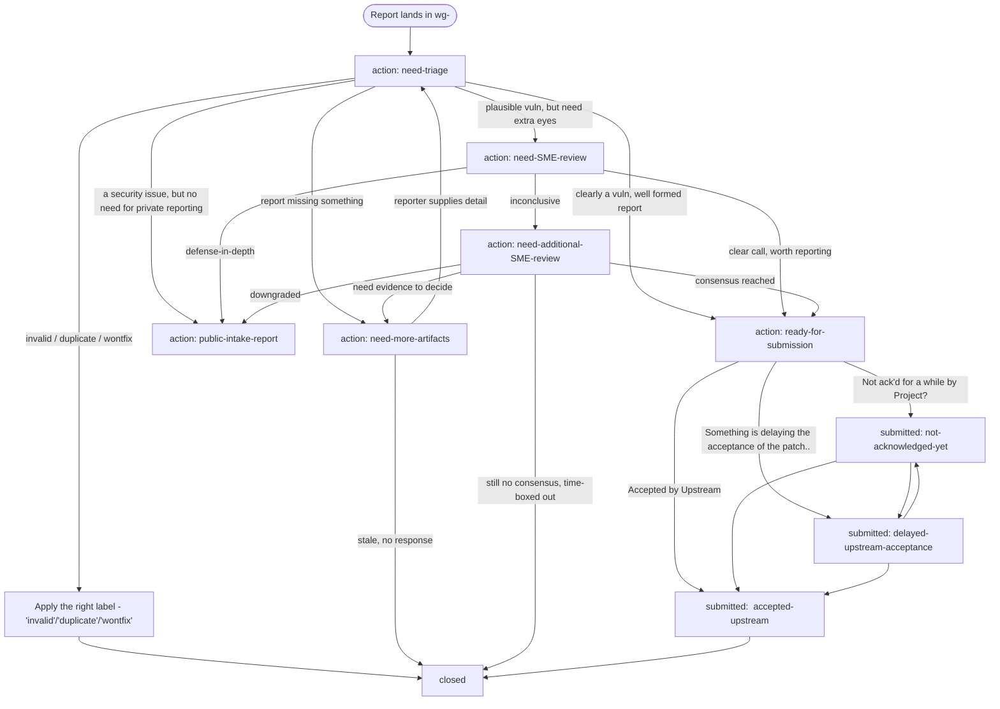

# Akrites GitHub Lightweight CVD Playbook
*Temporary, manual process for the SIRT on how to manage and coordinate disclosures outside of the automation pipeline.*

This process is a lightweight, manual version of the broader [CVD](Akrites_CVD_Playbook.md) process. It is meant to be temporary, and only to be used as a stopgap when we need to operate outside of The Akrites Pipeline ("TAP").

---
## Principles

- **Lean**: this is not a heavy, administrative process. It is laser-focused on operation.
- **Temporary**: we are not using this for long periods of time.
- **flexibility**: while this is a written process, we acknowledge and understand that the need for operating outside of a structured automation requires us to adapt. This process is able to do that.

---

Involved Parties, Definitions and Tools used by the process

## Parties involved
- **OSS SIRT** ("The SIRT"): A persistent "`SIRT-Team`" is available as a reviewer, assignee or just tagging in GitHub.
- **Akrites Members WG Rotations** ("The Rotation"): A member-staffed rotation is responsible for triaging, daily, the issue list in github.
- **Working Group Members**: subject matter experts who can both weigh in and help with vulnerabilties.

## Tools assisting this process
- **GitHub**: 
   - **Repositories**: https://github.com/Akrites-Foundation/
   - **Issues**: We rely on issues in the respective repositories.      
- **Slack**: 
   - **Slack Notification / bots**: Every vulnerability working group has a slack channel they ought to use for communicating. These follow the `#wg-<workingGroupName>` shape.
- **Templates**:
   - Upstream reporting template: [../templates/upstream-report-template.txt](../templates/upstream-report-template.txt)
   - Agentic skill to generate a report based on the template: \<TBD\>

### Labels
We rely on the following labels, and their definitions:

| Label | When to use | Responsible party for action |
| --- | --- | --- |
| `action: need-triage` | This label should not stick for long, and is used to explicitly force the Rotation to look and triaging an issue asap. | Rotation |
| `action: need-additional-SME-review` | We need subject matter experts to weigh in more in this issue. This could mean we are not aligned on what the severity is, or what we need to do on this. | Rotation, Working Group Members | 
| `action: need-more-artifacts` | We need more information or artifacts to this report. Typically used when we need patches or proof of concept attached. | Finder |
| `action: public-intake-report` | For post-triaged issues which are not severe enough to warrant a private reporting. This includes hardening and such bugs. | SIRT |
| `action: ready-for-submission` | Ready for sending to the project upstream. | SIRT |
| `submitted: not-acknowledged-yet` | Sent up, but yet to be getting a receipt... this could be normal, but we want to make sure we do not let those linger | SIRT |
| `submitted: delayed-upstream-acceptance` | issue is reported upstream, but seem stuck on something, somewhere... subjective, but should get attention once tagged. | SIRT |
| `submitted: accepted-upstream` | Submission was accepted upstream, we can close our issue. | - |
| `blocked: EMBARGOED` | Issue under special embargo, it stays here for now. | SIRT |

### Labels Workflow

SLOs and timelines

## SLOs and timelines we impose on ourselves

| Target (business days) | Measured Objective |
| --- | --- |
| **<= 1 day**: | **The Rotation** will perform a review of their queue every business day. |
| | **The SIRT** will respond to assigned tasks within 1 business day. |
| **<= 3 days**: | The maximum number of days we will keep something in our queue. |
| **7 days**: | The number of days after which we will ping upstream again on un-ack'd messages from Akrites. |

## Manual Process in GitHub
At the high level, this process exists to allow us to ensure we do not drop vulnerabilities. We prioritize getting fixes upstream.

**Daily**
- The Rotation checks the issues in the queue
- The SIRT ensures anything tagged with `action: ready-for-submission` or `action: submit-public-issue` is reported upstream accordingly

### Responsibiltiies of the groups
**The Rotation** ensures...
- the queue is getting attention every day
    - If there are tagged issues needing attention, they should get it
        - escalate or fetch experts on the slack channel as needed
        - if escalation is not working out, escalate to the SIRT
- issues get good questions and comments when unclear or missing informations based on the [UPSTREAM REPORT TEMPLATE](../templates/upstream-report-template.txt).

**The SIRT** ensures...
- all reporting `action:` labels are acted upon daily
- Reports are properly generated (see template and skill for assistance)
- Escalations from the Rotation are handled swiftly

**The Akrites Working Groups Members** ensure...
- a response is provided, or find The Right SME to get involved when needed or requested by the Rotation (when issues are tagged with `action: need-additionnal-SME-review` or similar)
- the issues reported are well-formed
    - we want to base this on the [UPSTREAM REPORT TEMPLATE](../templates/upstream-report-template.txt).
    - the reported issues are within the project's Threat Model
        - these can be fetched online for the most part.
