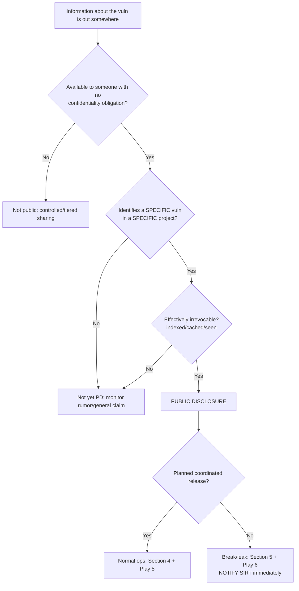
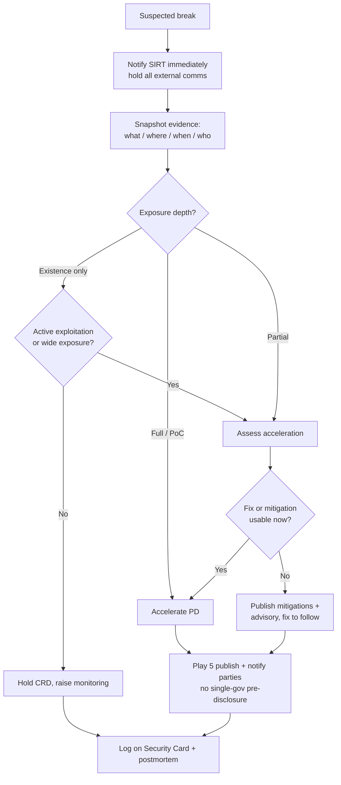

# What Counts as Public Disclosure — Process & Guidelines

**Owner:** Akrites SIRT
**Status:** Draft for TOC / Board review
**Tracking:** [Akrites-Foundation/SIRT #23](https://github.com/Akrites-Foundation/SIRT/issues/23)
**Audience:** Akrites members, WGs, SIRT staff, and ecosystem participants
**Companion docs:** `sirt-communications-playbook.md` (Play 5 public disclosure, Play 6 embargo break), `Embargo Handling Guidance.md`, `acknowledgements-and-attribution.md`

> Spelling standard: **Akrites** (Akrites Foundation, Akrites SIRT). "OSS-SIRT" is a synonym.

## Purpose (per issue #23)

Participants need a shared, unambiguous understanding of **when a vulnerability moves from being
coordinated privately (under embargo or another confidentiality arrangement) to being public
knowledge**, and **what to do when that happens** — whether the transition is planned (normal
coordinated disclosure) or unplanned (a leak or embargo break).

This document provides: a definition and bright-line test for public disclosure; the normal-operations
procedure; and the leak/break classification and response procedure.

---

## 1. Definitions

- **Public Disclosure (PD):** the point at which meaningful information about a vulnerability becomes
  available to the general public *without* an access restriction or confidentiality obligation.
  PD can be **intentional** (our coordinated release) or **unintentional** (a leak/break). Once
  information is genuinely public, it is public regardless of how it got there.
- **Embargo / confidentiality arrangement:** an agreement that named parties will hold vulnerability
  information privately until an agreed time or trigger. Default working window is 30 days from owner
  confirmation, negotiable and deferring to upstream (see Embargo Handling Guidance).
- **Coordinated Release Date (CRD):** the pre-agreed date/time for intentional PD, set when the fix
  is available and an identifier is assigned.
- **Tiered / read-in sharing:** sharing with specific trusted parties under a confidentiality
  obligation (TLP:RED/AMBER). This is **not** public disclosure — it is a controlled disclosure
  *boundary*, distinct from the public boundary.
- **Disclosure boundary vs. tier:** a *tier* is who is read in; a *boundary* is the line between
  confidential and public. Crossing the public boundary is PD; moving between tiers is not.
- **Silent patch:** a fix shipped publicly without describing the security issue. Because the
  vulnerability is often derivable from the diff, this is treated as a **partial public disclosure**
  (see §3.3).
- **Reasonably public / "already out":** information that is publicly reproducible or already posted
  such that it can no longer be treated as secret (e.g., a fix commit is live, a third party has
  published, or the issue is trivially rediscoverable — see §3.4).

---

## 2. The bright-line test

> **A vulnerability is publicly disclosed when specific information about it is available to any
> member of the public who did not agree to keep it confidential.  Reflect upon the possibility
> that a knowledgeable adversary could develop a working exploit from this.**

Apply three questions:

1. **Availability** — can someone outside the read-in/embargo circle obtain the information without
   a confidentiality obligation? (public URL, public repo, public list, media, talk, etc.)
2. **Specificity** — does what's available identify a *specific* vulnerability in a *specific*
   project (not just a general capability or rumor)? A fix commit or a CVE record clears this bar;
   a vague "we found bugs" post usually does not.
3. **Irrevocability** — is it effectively impossible to put back? (Even if deleted, was it indexed,
   cached, mirrored, or seen?)

If **all three** are yes, treat it as public. If in doubt, escalate to the SIRT — do not decide
alone.

---

## 3. What counts, what doesn't, and the edge cases

### 3.1 Counts as public disclosure

- Upstream publishes an advisory, release notes, or changelog naming/implying the security issue.
- A **CVE or other identifier record** (CVE-LIST, EUVD, OSV, GHSA) goes public.
- A **public fix commit, PR, or issue** that reveals or implies the vulnerability.
- A public **PoC/exploit**, blog post, mailing-list message, social post, or conference talk that
  describes the specific issue.
- **Independent third-party** public discovery/publication of the same issue.
- **Media reporting** with enough specificity to identify the vulnerability.

### 3.2 Does NOT count as public disclosure

- Read-in / tiered sharing with trusted parties under confidentiality (TLP:RED/AMBER).
- Sharing the disclosure packet with the maintainer or a coordinator under embargo.
- Internal Akrites case material, dashboards, or member-only notices that omit specifics.
- General awareness notices to members that give only a category and severity band (Play 4).
- A vague public statement that a class of bugs exists, without identifying the project/vuln.

### 3.3 Silent patches (partial disclosure)

A public fix without a security description still exposes the vulnerability to anyone who reads the
diff. Treat as **partial public disclosure**: the clock effectively starts, and the SIRT should move
to complete the record (identifier, advisory, machine-readable data) promptly so consumers aren't
left guessing. Coordinate with the maintainer on describing the issue.

### 3.4 "If we found it, others can" (LLM/fuzzer-discoverable)

Per prior guidance: something found with a **public LLM or fuzzer** is not treated as a secret in
the same way a privately-held finding is — reproducibility lowers the value of secrecy. This
**reduces the strength of an embargo argument**, but it does **not** by itself constitute public
disclosure. PD still requires that specific information has actually been made public (§2). Use this
factor when weighing timelines and acceleration decisions, not as a definition of PD.

### 3.5 Partial vs. full exposure

Distinguish what actually became public: **existence only** (a vuln exists in X) vs. **partial**
(some detail) vs. **full** (details + reproducer/exploit). This distinction drives the break response
in §5 — not every exposure is a full disclosure requiring immediate acceleration.

---

## 4. Normal operations — coordinated public disclosure

This is the planned, intentional crossing of the public boundary on the Coordinated Release Date.

### 4.1 Preconditions (all should be true before CRD)

- **Identifier assigned.** Nothing is published without a CVE (or equivalent) identifier — every
  issue through Akrites carries one.
- **Fix or mitigation available.** A fixed version, fixed commit, and/or deployable
  workaround/mitigation exists. If the full fix isn't ready in time, mitigations are shared rather
  than slipping silently.
- **Maintainer alignment.** The maintainer has set (or agreed to) the final fix and PD date; we
  defer to upstream where they have a process.
- **Machine-readable data ready.** CSAF VEX and OSV records, precise affected/fixed versions
  (tested), and references prepared alongside the human-readable advisory.
- **Attribution confirmed.** Finder acknowledgement preference recorded (see attribution doc).
- **Tiered obligations satisfied.** Any Tier 2+ pre-positioning is complete.

### 4.2 The moment PD occurs

PD is the moment the coordinated collateral is published to a public channel (Akrites website,
GHSA/OSV → CVE-LIST/EUVD, VEX feed) and the member notice/SIREN fires. From that instant the issue
is public and TLP:CLEAR. Execute Play 5 for the announcement mechanics.

### 4.3 Pre-PD readiness checklist

```
Coordinated PD readiness — {tracking-id}
[ ] Identifier assigned and reservable → public
[ ] Fixed version / fixed commit confirmed  (or mitigation ready)
[ ] Maintainer agreed fix + date
[ ] Affected/fixed versions tested and precise
[ ] CSAF VEX + OSV record staged
[ ] CVSS vector (not just score) prepared; deviation notice if scores conflict
[ ] Acknowledgement block finalized (finder preference)
[ ] Member notice + SIREN drafted
[ ] References assembled (advisory, patch, project links)
[ ] First-report date decided (publish? per policy)
[ ] Go/no-go owner and time confirmed
```

---

## 5. Embargo breaks & leaks — unplanned public disclosure

A **break** is any crossing of the public boundary that was not the coordinated release: a leak,
premature publication, a third party going public, a silent patch that exposes the issue, or an
independent public discovery.

### 5.1 Golden rule

**The SIRT coordinates the response to any break.** Anyone — member, WG, SME, maintainer — who
discovers or suspects a break **must notify the SIRT immediately** and must **not** respond publicly
or independently. How we react depends on *what* leaked and *how*.

### 5.2 Detect and confirm

Sources of detection: monitoring of public repos/advisory feeds, member reports, maintainer notice,
media, social. On a suspected break, capture: what leaked, where, when, who confirmed, and a snapshot
(link + timestamp) before anything is deleted. Assume deletion does not undo exposure (§2 irrevocability).

### 5.3 Classify the break

Classify on two axes; the intersection sets the default response.

| Exposure ↓ / Origin → | Accidental (ours/partner) | Intentional / malicious | Third-party / independent |
| --- | --- | --- | --- |
| **Existence only** | Contain; monitor; usually hold CRD | Contain; monitor; assess motive | Monitor; often hold CRD |
| **Partial detail** | Assess acceleration; notify parties | Lean toward acceleration | Assess; coordinate with the third party |
| **Full detail / PoC** | Accelerate PD | Accelerate PD immediately | Accelerate PD; deconflict credit |

"Accelerate" = bring the coordinated disclosure forward (possibly to now). "Hold" = keep the planned
CRD but increase monitoring and readiness.

### 5.4 Decision factors for acceleration

- **Exposure depth** — existence vs. partial vs. full/PoC (the dominant factor).
- **Active exploitation or IOCs** in the wild → accelerate.
- **Fix/mitigation readiness** — can users act if we go public now? If not, publish mitigations with
  the advisory even if the full fix trails.
- **Breadth of exposure** — how many, and who, can now see it.
- **Reproducibility** — if the issue is trivially rediscoverable (public LLM/fuzzer class), secrecy
  buys little (§3.4).
- **Maintainer & coordinator input** — gather quickly, but the protect-users clock doesn't wait
  indefinitely.

### 5.5 Response procedure

1. **Notify the SIRT** (mandatory, immediate) and open/mark the case as a break. Hold all external
   comms.
2. **Internal flash** to the case team — use Play 6, Step 1. Assign a decision owner and a deadline.
3. **Assess & classify** per §5.3–5.4. Snapshot the evidence.
4. **Decide: accelerate or hold.** Decision owner is the SIRT; escalate to TOC/Board for
   high-impact/critical-infra timing calls.
5. **Notify affected parties** — maintainer and coordinators (Play 6, Step 2), and read-in finders
   (Play 3). Balanced coordinator notice; **no single-government pre-disclosure.**
6. **If accelerating:** finalize the best-available advisory (fix or mitigation status stated
   honestly) and publish via Play 5. Fire the member notice/SIREN in parallel.
7. **If holding:** document why, raise monitoring, and confirm the CRD still stands with all parties.
8. **Record & learn:** log the break on the project **Security Card** (including any upstream/partner
   mishandling for future risk weighting) and run a **blameless postmortem** (Play 18).

### 5.6 Roles

- **Discoverer (anyone):** notify SIRT immediately; do not act publicly.
- **SIRT:** coordinate, classify, decide accelerate/hold, own all outbound comms.
- **Maintainer:** consulted; retains authority over their fix; timing may be overridden only to
  protect users after a confirmed public break.
- **Coordinators/clearinghouses:** notified in balanced fashion; may delegate their own read-ins.
- **TOC/Board:** decide high-impact/critical-infra acceleration and any policy deviations.

---

## 6. Quick-reference flowcharts

### 6.1 Is it public disclosure?



### 6.2 Break response



---

## 7. Open items for TOC / Board

- **Ratify the PD definition and bright-line test** (§2) and add key terms to the repo glossary
  (per the F2F action to define disclosure on the repo).
- Confirm treatment of **silent patches** as partial PD and the follow-up obligation (§3.3).
- Confirm the **"reproducible ≠ public"** stance and how heavily reproducibility weighs in
  acceleration (§3.4).
- Approve the **break classification/decision matrix** and who holds accelerate/hold authority
  (§5.3–5.4).
- Decide whether **first-report date** is published in advisories (§4.3).
- Confirm the **mandatory-notification** rule for anyone discovering a break (§5.1).

## 8. Cross-references

- Public disclosure mechanics: `sirt-communications-playbook.md` **Play 5**.
- Embargo break comms templates: `sirt-communications-playbook.md` **Play 6**.
- Read-in finder updates / postmortem: **Play 3**, **Play 18**.
- Embargo windows and extensions: `Embargo Handling Guidance.md`.
- Attribution at PD: `acknowledgements-and-attribution.md`.

